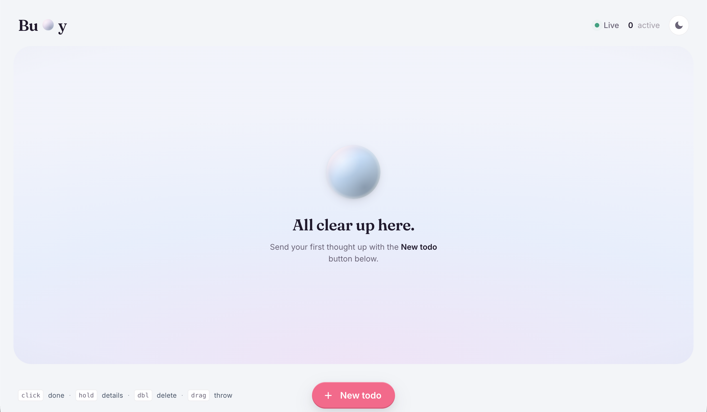
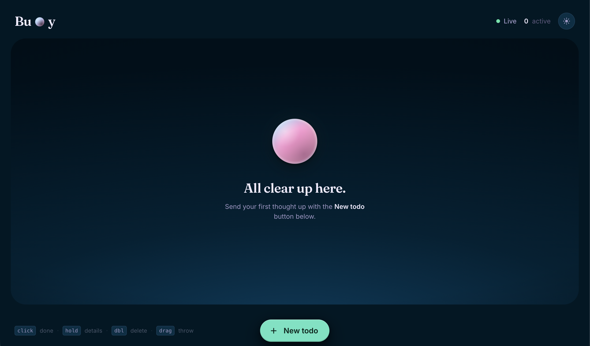

# 🫧 Buoy

A floating-bubble to-do app.

Each task is a bubble. Bigger bubbles (higher priority) rise to the top of the canvas, bob around, and gently attract each other. Click to complete (the bubble *pops*), right-click or long-press to see details, drag to throw it across the screen. The "database" is a single human-editable `data/todos.md` file — edit it on your host in any text editor and the running app picks up the change over WebSocket within ~100ms.

| Daydream (light) | Nightswim (dark) |
|:---:|:---:|
|  |  |

## Stack at a glance

| Layer    | Tech                                                       |
|----------|------------------------------------------------------------|
| Frontend | React 18 · Vite · matter.js (physics) · framer-motion       |
| Backend  | Node 20 · Express · `ws` (WebSockets) · `chokidar` (file watcher) |
| Storage  | a plain `todos.md` file (no real DB)                       |
| Dev      | `docker-compose.yml` with two containers + bind mounts     |
| Prod     | single multi-stage `Dockerfile` — Express serves both API and built bundle on one port |

## Quickstart

### Dev (hot reload on both sides)

```bash
docker compose up --build
```

Then visit **http://localhost:5173**. Edits to `frontend/src/*` hot-reload via Vite HMR; edits to `backend/src/*` restart Node (`--watch`); edits to `data/todos.md` push to the UI via WebSocket.

### Without Docker (two terminals)

```bash
# Terminal 1
cd backend && npm install && npm run dev      # → http://localhost:3004

# Terminal 2
cd frontend && npm install && npm run dev     # → http://localhost:5173
```

### Production (one container, one port)

```bash
docker build -t buoy:prod .
docker run --rm -p 3004:3004 -v "$PWD/data:/app/data" buoy:prod
# Visit http://localhost:3004
```

The bundle is built with empty `VITE_API_URL`/`VITE_WS_URL` so it uses same-origin relative paths — works behind any reverse proxy, on any host, http or https.

## The data file

`data/todos.md` is plain markdown. Metadata rides in an HTML comment so it's invisible when rendered:

```markdown
# Buoy Todos

- [ ] Buy milk <!-- id:a1b2c3 priority:3 created:2026-05-21T10:00:00Z description:"From the corner store" -->
- [x] Ship the bubble app <!-- id:d4e5f6 priority:5 created:2026-05-20T09:00:00Z completed:2026-05-20T18:00:00Z -->
```

You can hand-type `- [ ] something new` with no metadata — the parser tolerates the absence, and the next write fills in defaults (new id, priority 3, timestamps).

## Repo layout

```
buoy/
├── Dockerfile            # multi-stage prod image
├── docker-compose.yml    # dev: 2 services with bind mounts
├── data/
│   └── todos.md          # ← the "database"
├── backend/              # Node + Express + ws
│   ├── Dockerfile        # dev image
│   ├── src/
│   │   ├── server.js
│   │   ├── app.js
│   │   ├── routes/todos.js
│   │   ├── store/        # parser, serializer, store, watcher
│   │   └── ws.js
│   └── test/             # vitest (27 tests)
├── frontend/             # React + Vite
│   ├── Dockerfile        # dev image
│   ├── public/favicon.svg
│   └── src/
│       ├── App.jsx
│       ├── api.js · useTodos.js
│       └── components/   # BubbleCanvas, AddTodoModal, DetailOverlay
└── docs/                 # architecture + design notes
```

## Interactions

| Gesture                   | Action                       |
|---------------------------|------------------------------|
| **Click** a bubble        | Toggle done (pop animation)  |
| **Right-click / long-press** | Open the detail overlay      |
| **Double-click**          | Delete                       |
| **Drag**                  | Throw — physics resumes on release |
| **+** floating button     | Open the add-todo modal      |

## Tests

```bash
cd backend && npm test         # 27 vitest tests (parser, store, routes, ws)
```

There are no frontend unit tests — the React side is verified by clicking through the running app.
