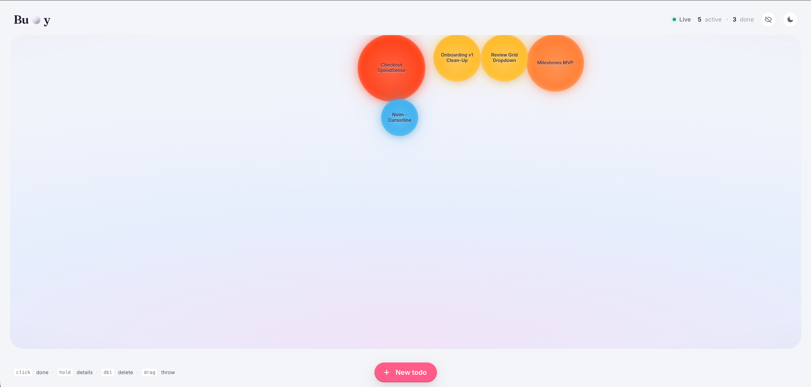
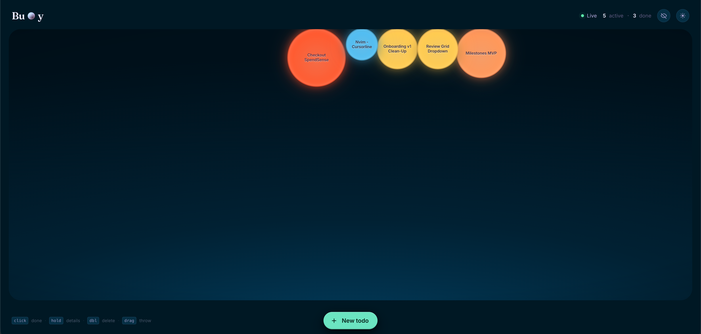

# 🫧 Buoy

A floating-bubble to-do app.

Each task is a bubble. Bigger bubbles (higher priority) rise to the top of the canvas and bob around. Click to complete (the bubble _pops_), right-click or long-press to see details, drag to throw it across the screen. The "database" is a single human-editable `data/todos.md` file — edit it on your host in any text editor and the running app picks up the change over WebSocket within ~100ms.

|                   Daydream (light)                   |                   Nightswim (dark)                   |
| :--------------------------------------------------: | :--------------------------------------------------: |
|  |  |

## Run Buoy Locally

### Dev (hot reload on both sides) - _QUICKEST_

```bash
docker compose up --build
```

Then visit **<http://localhost:5173>**. Edits to `frontend/src/*` hot-reload via Vite HMR; edits to `backend/src/*` restart Node (`--watch`); edits to `data/todos.md` push to the UI via WebSocket.

### Without Docker (two terminals) - _Why would you prefer this?_

```bash
# Terminal 1
cd backend && npm install && npm run dev      # → http://localhost:3004

# Terminal 2
cd frontend && npm install && npm run dev     # → http://localhost:5173
```

### Production (one container, one port) - _IDEAL_ :)

```bash
docker build -t buoy:prod .
docker run --rm -p 3004:3004 -v "$PWD/data:/app/data" buoy:prod
# Visit http://localhost:3004
```

The bundle is built with empty `VITE_API_URL`/`VITE_WS_URL` so it uses same-origin relative paths — works behind any reverse proxy, on any host, http or https.

## Stack at a glance

| Layer    | Tech                                                                                   |
| -------- | -------------------------------------------------------------------------------------- |
| Frontend | React 18 · Vite · matter.js (physics) · framer-motion                                  |
| Backend  | Node 20 · Express · `ws` (WebSockets) · `chokidar` (file watcher)                      |
| Storage  | a plain `todos.md` file (no real DB)                                                   |
| Dev      | `docker-compose.yml` with two containers + bind mounts                                 |
| Prod     | single multi-stage `Dockerfile` — Express serves both API and built bundle on one port |

## The data file

`data/todos.md` is plain markdown. Metadata rides in an HTML comment so it's invisible when rendered:

```markdown
# Buoy Todos

- [ ] `nvim` - Install harpoon <!-- id:a1b2c3 priority:2 created:2026-05-21T10:00:00Z description:"From the corner store" -->
- [x] Ship the bubble app <!-- id:d4e5f6 priority:0 created:2026-05-20T09:00:00Z completed:2026-05-20T18:00:00Z -->
```

You can hand-type `- [ ] something new` with no metadata — the parser tolerates the absence, and the next write fills in defaults (new id, priority 2, timestamps). Priorities run 0–4, with **P0 being the most urgent** (biggest, hottest bubble).

## Interactions

|                     Daydream (light)                     |                     Nightswim (dark)                     |
| :------------------------------------------------------: | :------------------------------------------------------: |
|   |     |

| Gesture                      | Action                             |
| ---------------------------- | ---------------------------------- |
| **Click** a bubble           | Toggle done (pop animation)        |
| **Right-click / long-press** | Open the detail overlay            |
| **Double-click**             | Delete                             |
| **Drag**                     | Throw — physics resumes on release |
| **+** floating button        | Open the add-todo modal            |
